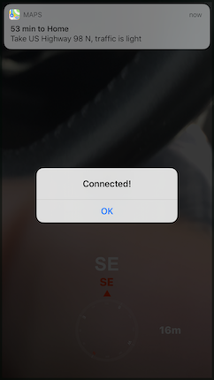

# react-native-car-connect

## About

Detect when your phone connects or disconnects to your car (handsfree/bluetooth)
Currently only working for iOS. Android will be available soon.



## Getting started

`$ npm install react-native-car-connect --save`

### Mostly automatic installation

`$ react-native link react-native-car-connect`

### Manual installation

#### iOS

1. In XCode, in the project navigator, right click `Libraries` ➜ `Add Files to [your project's name]`
2. Go to `node_modules` ➜ `react-native-car-connect` and add `CarConnect.xcodeproj`
3. In XCode, in the project navigator, select your project. Add `libCarConnect.a` to your project's `Build Phases` ➜ `Link Binary With Libraries`
4. Run your project (`Cmd+R`)<

#### Android

1. Open up `android/app/src/main/java/[...]/MainApplication.java`

- Add `import com.reactlibrary.CarConnectPackage;` to the imports at the top of the file
- Add `new CarConnectPackage()` to the list returned by the `getPackages()` method

2. Append the following lines to `android/settings.gradle`:
   ```
   include ':react-native-car-connect'
   project(':react-native-car-connect').projectDir = new File(rootProject.projectDir, 	'../node_modules/react-native-car-connect/android')
   ```
3. Insert the following lines inside the dependencies block in `android/app/build.gradle`:
   ```
     compile project(':react-native-car-connect')
   ```

## Usage

```javascript
import { useEffect } from "react";
import CarConnect from "react-native-car-connect";
import { NativeEventEmitter } from "react-native";

const CarEvents = new NativeEventEmitter(CarConnect);

function ConnectFunctionalComponent() {
  useEffect(
    () => {
      CarEvents.addListener("onConnect", res => {
        alert("Car connected state = ", res);
      });
      CarEvents.addListener("onDisconnect", res => {
        alert("Car disconnected state = ", res);
      });
      // pass in true to use background thread
      CarConnect.start(true);
      return () => {
        CarConnect.stop(true);
      };
    },
    [],
    []
  );

  return null;
}

// check if connected
console.log(CarConnect.connected);

// example usage with functional component
function App() {
  return <ConnectFunctionalComponent />;
}
```
